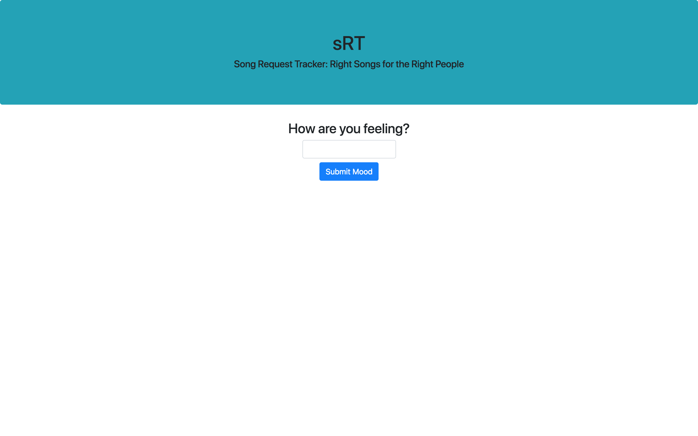
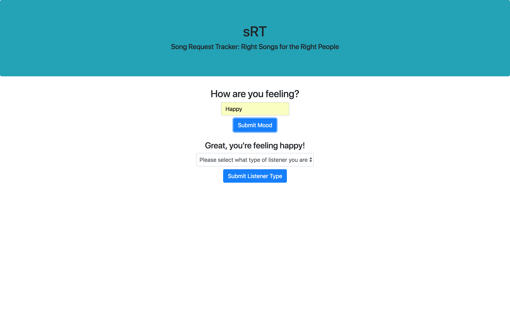
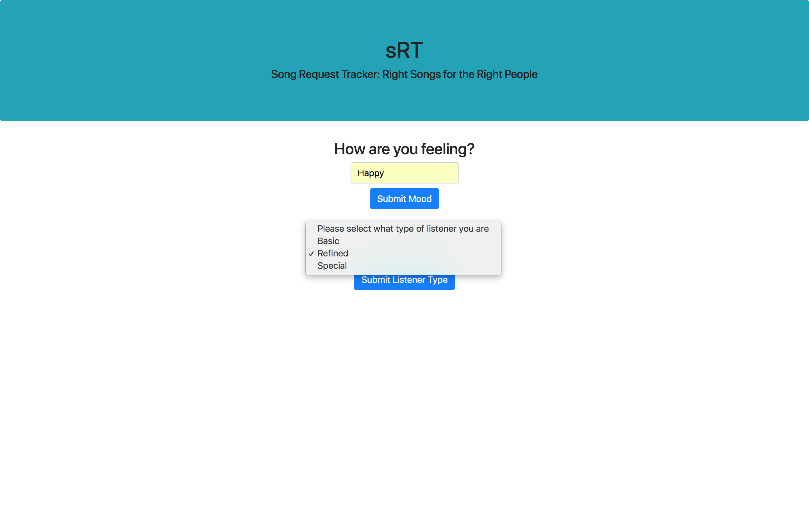
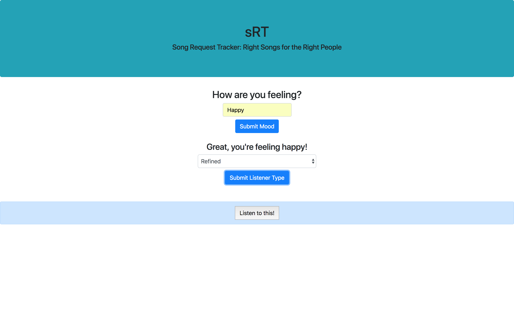
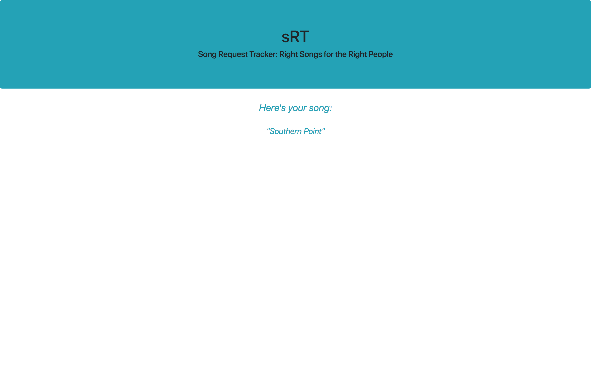

# README

## Description

sRT (Song Request Tracker) is a full stack application that presents the user with a song recommendation when they enter their mood and what type of listener they are.

## Example

Here are images of sRT running in the browser: 






## Features

- UI that lets the user go through a series of coices to find the right song for them
- Server that searches the database for and displays the right song based on the        user's input

## Technologies Used

sRT uses an Angular front-end and Node.js back-end along with Sequelize and a PostgreSQL database.

## Installation Instructions

You will be able to run the the project in your browser soon — I will deploy this project in December 2018.

If you want to run the sRT locally, follow the following instructions:

(Mac)
1. Assuming you have SSH set up for Github, open a new terminal tab, and in that tab, run the following bash commands after you change into the directory where you want to store this repository:
  ```bash
  $ git clone git@github.com:blinkhorn/sRT.git
  $ cd sRT
  $ npm install
  ```
2. Run the Angular front-end using the following bash command:
```bash
$ ng s --o
```
This command will open the application in your default browser.

3. run
```bash
$ cd server
$ npm run start:dev
```
This will start up the node.js server

4. You will have to create and seed a database in order to be returned songs. Use this tutorial as a guide for using my Sequelize code with a Postgres database:
https://scotch.io/tutorials/getting-started-with-node-express-and-postgres-using-sequelize

## Contribution Guidelines

To contribute to my code, identify bugs, and propose improvements, please
submit issues [here](https://github.com/blinkhorn/sRT/issues "sRT issues").
